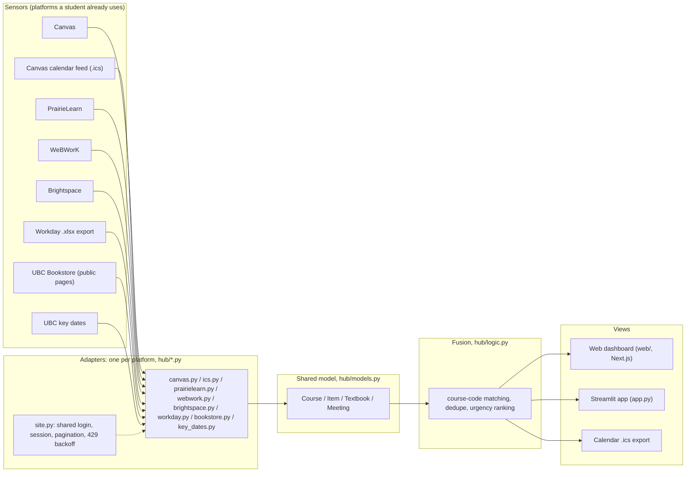
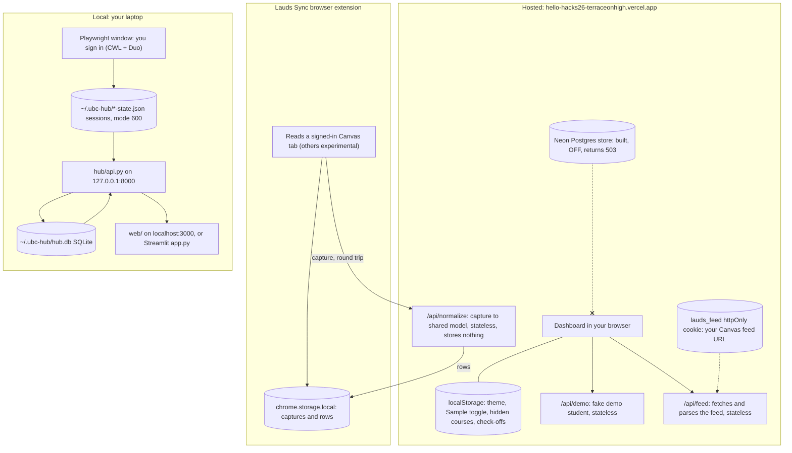
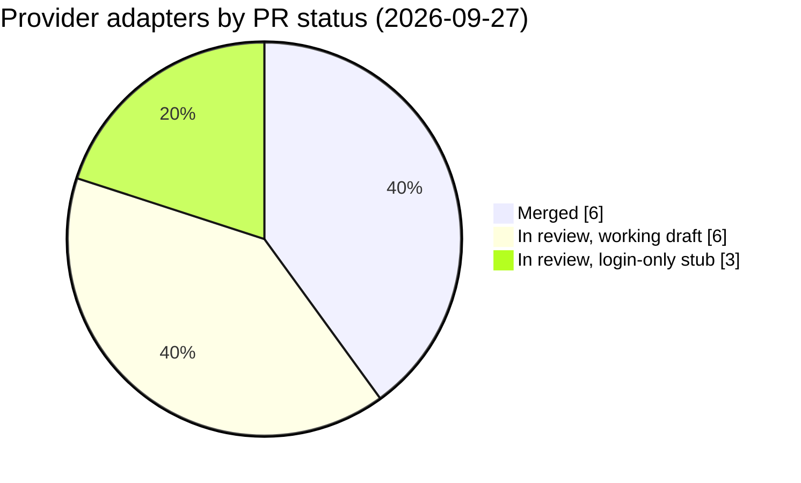
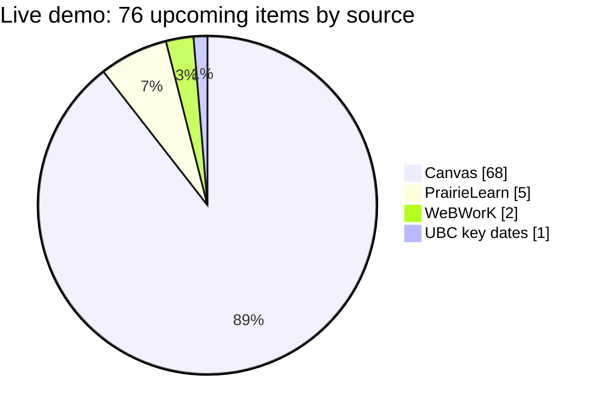

# Lauds

**The first thing you check in the morning.**

**▶ Try it live: [hello-hacks26-terraceonhigh.vercel.app](https://hello-hacks26-terraceonhigh.vercel.app/)**. No install, no login. It opens on a made-up demo student.

Lauds is a read-only student dashboard that answers "what do I need to do this week?" Every platform a student already uses (Canvas, PrairieLearn, WeBWorK, Workday, the UBC Bookstore and others) is a sensor. Each platform gets one adapter that turns its data into a small shared model: `Course`, `Item`, `Textbook` and `Meeting` in [`hub/models.py`](hub/models.py). Fusion then runs on that shared model, never on raw provider data: course codes are matched across sources (`CPSC_V 110-101` and `CPSC 110` become one course), exact duplicates merge, and everything is ranked by urgency. Adding a platform needs no change to the core model or logic.

## Why

- Students lose real time to admin overhead: five or more systems, each with its own login, calendar and idea of "due".
- Canvas only sees Canvas. WeBWorK, PrairieLearn, Workday and the Bookstore never reach its To-Do list.
- Lauds puts them in one view and links each item back to where it lives. Lauds is read-only: it opens the item in its own platform and never writes back.

## Contents

- [How it works](#how-it-works)
- [Where your data lives](#where-your-data-lives)
- [Features](#features)
- [Providers](#providers)
- [The live demo](#the-live-demo)
- [Quickstart](#quickstart)
- [Privacy and security](#privacy-and-security)
- [Known limitations](#known-limitations)
- [Repo layout](#repo-layout)
- [Deploy](#deploy)
- [Contributing](#contributing)
- [Pitch materials](#pitch-materials)
- [Team](#team)
- [Contact](#contact)
- [License](#license)

## How it works



- **Adapters** (`hub/<provider>.py`) each expose one `fetch(...)` returning shared-model objects with `source` set. Sites the student logs into reuse `hub/site.py` for login, the saved session, pagination and 429 backoff.
- **Identity** of an item is `(source, url)`, the upsert key in `hub/db.py`.
- **Urgency** is a transparent heuristic, `classify_urgency()` in `hub/models.py`: a grade weight guessed from keywords in the title ("final", "midterm", "quiz"...) divided by hours until due, bucketed into overdue / high / medium / low. `hub/logic.py`'s `sort_items()` ranks by it. It is not machine learning.
- **Dedupe** (`logic.dedupe()`) merges exact matches on course, title and due time after course codes are normalised. It runs in the demo pipeline today. A fuzzy detector (`suspected_duplicates()`) is built but not wired in.
- **One provider failing can't take down the others.** A broken source shows "unavailable" and the rest of the dashboard keeps working.

## Where your data lives



| Where | What is stored | Notes |
| --- | --- | --- |
| Your browser, `localStorage` | Theme, custom colours, Sample toggle, hidden courses, check-offs | Per browser. Nothing here reaches a server. |
| Your browser, cookies | `lauds_feed` (httpOnly): your Canvas feed URL. `hub-preferred-kinds`: "What matters to you" picks | The feed URL is a secret, so page JavaScript can't read it. |
| Vercel functions (`web/api/`) | Nothing | `/api/demo`, `/api/feed` and `/api/normalize` are stateless. |
| Hosted store (`/api/sync`, `/api/items`, `/api/session`) | Nothing yet | Built for Neon Postgres, **off**: answers 503 until `DATABASE_URL` is set. |
| Extension, `chrome.storage.local` | Latest captures and normalised rows per provider | Removed when the extension is removed. |
| Your laptop, `~/.ubc-hub/` | `hub.db` (SQLite) and `<site>-state.json` browser sessions | Session files are mode 600, plaintext JSON, not encrypted. Never in the repo. |

## Features

**On the hosted site (no install)**

- **Full-semester demo through the real adapters.** Sample mode replays saved, fake provider responses for a made-up student ("Stu Dent") through the same Canvas, calendar-feed, PrairieLearn, WeBWorK, Brightspace, Piazza, Workday, Bookstore and key-dates code a live fetch uses, then fuses them ([`hub/demo.py`](hub/demo.py), PRs #99, #107).
- **Sample / honest mode.** Turn Sample data off and the dashboard never shows fake rows: only what you've actually connected (PR #100).
- **Canvas calendar-feed paste.** Paste your Canvas `.ics` feed link in Settings. `/api/feed` fetches it from an allowlisted Canvas host and keeps the URL in the `lauds_feed` httpOnly cookie. Honest limits: a feed can't tell what you've submitted, and it skips undated assignments.
- **Workday import.** Choose your "View My Courses" `.xlsx` export. It's parsed entirely in the browser (`web/lib/workday.js`, a port of `hub/workday.py`): courses merge into the dashboard and class meetings fill the **Schedule** tab.
- **Download .ics for your classes, with reminders** (PR #112). Turn imported Workday meetings into a weekly recurring calendar file; set reminders in minutes before each class (for example `10,30`).
- **Deep links on every row** (PR #110). A chain-link icon opens the item where it lives; hover or focus it to see the URL.
- **Views:** Overview, Assignments, Calendar (month grid), Schedule (weekly grid), Materials, Announcements, Courses.
- **Settings behind the gear icon:** connections, Sample toggle, appearance, course visibility.
- **"What matters to you."** Pick the kinds you personally care about (exams, quizzes, assignments, readings, projects). Matching items get a Priority badge and move to the front of their urgency group; the urgency itself doesn't change.
- **Check-off.** Mark an item done to hide it. Stored in this browser only; it does not mark anything done in Canvas.
- **Themes:** Everforest, Solarized, Gruvbox, Catppuccin, or a custom four-colour scheme.

**With a local install or the extension**

- **Connect Canvas and PrairieLearn with your own login.** Local mode opens a real browser window; you sign in with CWL and Duo yourself, and Lauds reuses that session to read the same JSON (Canvas) or page (PrairieLearn) you'd see. PrairieLearn supports UBC Vancouver, UBC Okanagan and a pasted custom instance.
- **Browser extension, "Lauds Sync"** ([`extension/`](extension/), [docs](docs/extension-sync.md)). Captures Canvas from a tab you're signed into, on demand or every 30 minutes while that tab is open. Moodle, Blackboard, Piazza and PrairieLearn captures are registered as experimental.
- **Standalone sync CLI** ([`tools/sync.sh`](tools/sync.sh)). Downloads just the files `hub/sync_cli.py` needs, opens a login window per provider, scans Canvas and PrairieLearn and prints a sync key. Pushing to the hosted dashboard waits on the hosted store, which is off.
- **Calendar `.ics` export (local).** `hub/api.py` serves `/calendar.ics` (everything) and `/calendar/<kind>.ics` (one colour-coded feed per kind, with reminders). The Streamlit app has an "Add to my calendar" download. This is served locally today; hosted is next.
- **Streamlit app** (`app.py`): the original dashboard, with its own Sample toggle, tabs, Workday import and key dates.

## Providers

Status as of 2026-09-27. "Local only" means it needs `hub/api.py` running on your laptop.

| Provider | What it reads | How | Status |
| --- | --- | --- | --- |
| Canvas | Courses, assignments, planner items, current score | Canvas's own `/api/v1` JSON with your browser session | Merged. Local only (connect); extension capture merged |
| Canvas calendar feed | Dated assignments and events | Your `.ics` feed URL | Merged. **Live on hosted** |
| Workday | Courses and class meetings | Your "View My Courses" `.xlsx`, parsed in the browser | Merged. **Live on hosted** |
| PrairieLearn | Assessments and due dates per course | Page read of the Assessments page you'd see (no student API) | Merged. Local only; extension capture experimental |
| WeBWorK | Problem sets and due dates | Page read of the problem-set list (no student API) | Adapter merged (#91); connect button in review (#88) |
| Brightspace | Your active course enrollments | D2L's own JSON with your browser session | Adapter merged (#92); connect button in review (#88) |
| UBC key dates | Add/drop, tuition, exam period | Hand-maintained from the Academic Calendar | Merged. Streamlit app and demo |
| UBC Bookstore | Sections, required textbooks, prices, store links | Public, logged-out pages only | Code on main, used by the demo; PR #96 in review |
| Piazza | Pinned and instructor posts (no due dates) | Piazza's JSON RPC | Code on main, used by the demo; unverified live; PRs #79, #103 in review |
| Moodle | Courses and events | Moodle's AJAX JSON with your session | Unverified draft (no test account); PR #60 in review |
| Blackboard | Courses only | Blackboard REST JSON with your session | Unverified draft; PR #61 in review |
| Google Classroom | Courses and coursework | OAuth2 API | In review (#77) |
| Ed Discussion | Courses and pinned posts | API token | In review (#78) |
| Crowdmark | Login only | Browser session | Login-only stub, in review (#64) |
| Pearson MyLab / Mastering | Login only | Browser session | Login-only stub, in review (#63) |
| Macmillan Achieve | Login only | Browser session | Login-only stub, in review (#62) |

Counted by each adapter's own PR: merged is Canvas (API and feed counted as one), PrairieLearn, Workday, WeBWorK, Brightspace and UBC key dates.



## The live demo

The hosted site calls `/api/demo`, which runs `hub/demo.py` over fake fixtures: no login, no network calls to any school, no database. Fixture dates are relative to today, so the demo student is always mid-term. Numbers from the live demo on 2026-09-27:

| Upcoming items | Announcements | Courses | Class meetings | Textbooks |
| ---: | ---: | ---: | ---: | ---: |
| 76 | 8 | 6 | 9 | 3 |



The demo fixtures are written to match, so the demo shows the pipeline working, not how messy real data is.

## Quickstart

### 1. Just open it

Go to **https://hello-hacks26-terraceonhigh.vercel.app**. To see your own data there, open Settings (gear icon), turn Sample data off, then paste your Canvas calendar-feed link and/or import your Workday `.xlsx`.

### 2. Run locally with real data

Needs [uv](https://docs.astral.sh/uv/) and Node.js. From the repo root:

```bash
uv sync
uv run playwright install chromium     # the browser window you log in with
uv run python -m hub.api               # local API on 127.0.0.1:8000
```

In a second terminal:

```bash
cd web
npm ci
NEXT_PUBLIC_HUB_API=http://localhost:8000 npm run dev
```

Open **http://localhost:3000** (use `localhost`, not `127.0.0.1`: the API only answers that exact origin). In Settings, turn Sample data off and press **Connect** next to Canvas or PrairieLearn. A browser window opens; sign in with CWL yourself, and your items appear.

### 3. Streamlit app

```bash
uv run streamlit run app.py            # opens http://localhost:8501
```

### 4. Tests

```bash
uv run pytest                          # 325 backend tests, all on saved snapshots
cd web && npm test                     # web/lib unit tests (node --test)
```

No test calls a real server. Live checks against real UBC accounts were done by hand and are written up in the PRs.

## Privacy and security

- **No password handling.** You sign in to each platform yourself, in its own window. Lauds never sees your CWL password.
- **Your password and session never leave your laptop.** Local sessions live in `~/.ubc-hub/<site>-state.json`, mode 600. They're plaintext JSON, not encrypted.
- **Some data does pass through a server.** The extension posts captures (including Canvas's current score) to the stateless `/api/normalize` function on Vercel and gets rows back. It stores and logs nothing, but it is a server hop, likely in a US region, with no region pinned.
- **The feed link is treated like a password.** It's kept in an httpOnly cookie, fetched only from allowlisted Canvas hosts, and never logged.
- **The hosted store is off.** `/api/sync`, `/api/items` and `/api/session` return 503. When it's turned on, the server keeps only a SHA-256 hash of your sync key.
- **Read-only, your own data only.** Logged-in sites are read as JSON where the site has it. PrairieLearn and WeBWorK have no student API, so Lauds reads the page you already see, one request per course, backing off on 429. The Bookstore is read from public, logged-out pages only.
- Not reviewed yet: no UBC approval, no privacy impact assessment, no accessibility audit.

## Known limitations

- On the hosted site, real data is only the Canvas feed paste and the Workday import. Canvas login and PrairieLearn need a local install.
- Cross-source dedupe is exact-match only and runs in the demo pipeline. The real store dedupes on `(source, url)`, which never merges two sources.
- Urgency is a keyword-and-deadline heuristic. The 72% classifier in `scripts/` is an offline experiment on synthetic data, and nothing on screen uses it.
- Items are as fresh as the last sync. There's no background refresh and no "last synced" time yet. Overdue flags recompute on every read.
- Check-offs live in one browser and don't sync anywhere.
- The subscribable calendar feed is served locally today; hosted is next.
- If a platform changes its pages, that provider shows "unavailable" and saved items survive, but nothing alerts us.
- No mobile app. No Content-Security-Policy yet.
- No users beyond the team yet.

## Repo layout

| Path | What it is |
| --- | --- |
| `hub/models.py` | The shared model: `Course`, `Item`, `ItemFile`, `Textbook`, `Meeting`, plus `classify_urgency()` and `status_of()` |
| `hub/logic.py` | Fusion: `sort_items()`, `normalise_course_code()`, `dedupe()`, `suspected_duplicates()` |
| `hub/<provider>.py` | One adapter per platform (see [Providers](#providers)) |
| `hub/site.py` | Shared "student logs in themselves" core: login window, saved session, pagination, 429 backoff |
| `hub/db.py` | SQLite at `~/.ubc-hub/hub.db` (plus the dormant Postgres backend) |
| `hub/api.py` | Local JSON API and `.ics` feeds on 127.0.0.1:8000 (stdlib only) |
| `hub/demo.py`, `hub/demo_fixtures/` | The zero-click demo student |
| `hub/export_ics.py` | Merged and per-kind `.ics` export |
| `hub/captures.py`, `hub/hosted.py` | Extension-capture dispatch and hosted-sync validation |
| `hub/sync_cli.py`, `tools/sync.sh` | Standalone sync CLI and its one-line downloader |
| `hub/cli.py` | Inspect the local API without a UI |
| `app.py` | Streamlit dashboard |
| `web/` | Next.js dashboard (`app/page.js`, `lib/`), Vercel Python functions (`api/`) |
| `extension/` | "Lauds Sync" Chrome extension (Manifest V3) |
| `tests/` | pytest suite, network-free |
| `fixtures/` | Fake or anonymised sample data |
| `docs/` | [design](docs/design.md), [API standards](docs/api-standards.md), [extension sync](docs/extension-sync.md), pitch, handoffs |

## Deploy

- Tests run on every push and PR ([`.github/workflows/ci.yml`](.github/workflows/ci.yml)).
- Deploys are **ship-on-request**: `gh workflow run Tests --ref main` runs the tests, then builds and deploys to Vercel production. Pushes don't deploy, to stay under the Vercel Hobby daily deploy cap.
- CI copies `hub/` into `web/hub/` before the build so the Python functions in `web/api/` can import it.

## Contributing

Read [AGENTS.md](AGENTS.md) first: the mission, the backend contract, branch rules and the coordination protocol. GitHub issues are the task list, and the pinned **Agent board (#15)** is where cross-cutting changes get proposed. Work on your own branch and open a PR into `main`.

## Pitch materials

[`docs/pitch/`](docs/pitch/) holds the HelloHacks deck source (`deck.json`, `slides/`, `images/`). The speaker notes (`SPEAKER-NOTES.md`) and the judge Q&A cheat sheet (`JUDGE-CHEATSHEET.md`) are in PR #111 and not on `main` yet.

## Team

| Name | GitHub | Role |
| --- | --- | --- |
| Terrace Hung | [@terraceonhigh](https://github.com/terraceonhigh) | PM, frontend, reviews |
| Jacky Xue | [@Random-Alpaca](https://github.com/Random-Alpaca) | Backend lead: adapters, shared model, reviews |
| Sam Lidder | [@SamLidder](https://github.com/SamLidder) | Core logic |
| Vihaan Shah | [@itsvihaanshah](https://github.com/itsvihaanshah) | Exploration, UI pieces |

## Contact

Questions, bugs or ideas: [open a GitHub issue](https://github.com/terraceonhigh/helloHacks26/issues/new). You can also mention any team member by their GitHub handle above.

## License

Copyright (c) 2026 the Lauds authors (Terrace Hung, Jacky Xue, Sam Lidder, Vihaan Shah, and other contributors in the git history). All rights reserved. The source is public to read, but no license is granted to copy, modify or redistribute it. See [LICENSE](LICENSE).
